# 🌍 Wide World Importers Business Intelligence & Advanced Analytics

An end-to-end Business Intelligence and Advanced Analytics solution built in **Power BI** for a wholesale distribution business using the **Wide World Importers** dataset.  
The project combines **SQL, Power Query, DAX, data modeling, KPI reporting, forecasting and dashboard storytelling** to analyze sales performance, customer behavior, supply chain operations, supplier activity, profitability, warehouse operations, financial reporting and business recommendations.

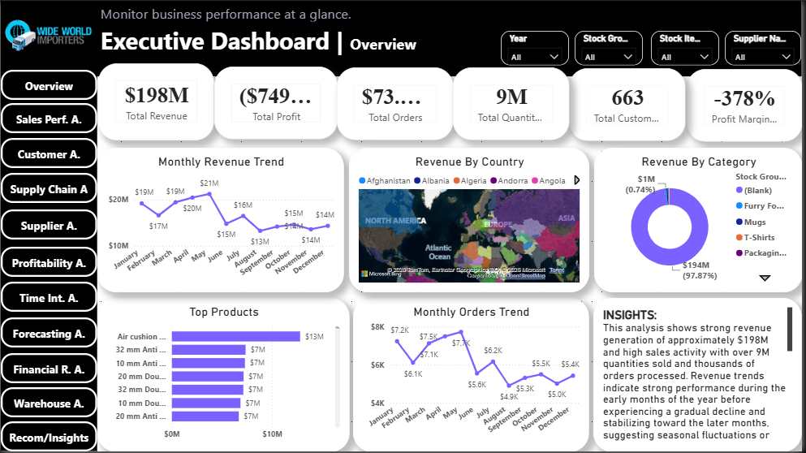

---

## 📸 Project Snapshot

| Metric | Value |
|--------|------:|
| 💰 Total Revenue | **$198M** |
| 📦 Total Orders | **73K+** |
| 👥 Total Customers | **663** |
| 📊 Quantity Sold | **9M** |
| 📈 Sales Growth | **15.09%** |
| 📉 Total Profit | **($749M)** |
| 📊 Dashboards | **11** |

---

## 📌 Project Overview

This project presents a comprehensive **Business Intelligence and Advanced Analytics Dashboard Solution** developed for the **Wide World Importers** wholesale distribution business using **Power BI**.

The solution was designed to transform raw operational data into a centralized reporting system that supports strategic decision-making across multiple business functions including **sales, customer performance, supply chain operations, supplier management, profitability, financial reporting, warehouse analysis, time intelligence, and forecasting**.

The project followed an end-to-end analytics workflow beginning with **SQL database setup**, followed by **data extraction into Power BI**, **data cleaning and transformation in Power Query**, **data modeling**, **DAX measure creation**, and finally **dashboard design and business storytelling** across eleven analytical dashboard pages.

---

## 🎯 Business Problem

Wide World Importers operates across multiple business functions including customers, suppliers, products, inventory, logistics, invoicing and financial transactions. However, without a centralized analytical framework, it becomes difficult for management to answer critical business questions such as:

- Which products, customers and regions drive the most revenue?
- Where are operational inefficiencies reducing profitability?
- Which suppliers are underperforming or overly dominant in procurement activity?
- How are warehouse and inventory operations affecting product availability?
- What financial and payment trends require management attention?
- How can time-based trends and forecasting support better planning?

The business requires an integrated analytics solution that provides visibility into both operational performance and strategic decision drivers.

---

## 🎯 Project Objectives

The objective of this project was to build an end-to-end business intelligence solution that:

- Monitors revenue, order volume and customer activity
- Evaluates customer behavior and top customer contribution
- Tracks procurement, supplier performance and supply chain efficiency
- Measures profitability, cost pressure and revenue-to-cost relationships
- Analyzes inventory movement and warehouse performance
- Reviews payment activity and financial reporting metrics
- Examines time-based sales trends and business growth patterns
- Supports demand planning through forecasting and predictive analysis
- Delivers executive-level recommendations for strategic decision-making

---

## 🛠️ Tools & Technologies

- **Power BI**
- **SQL**
- **Power Query**
- **DAX**
- **Microsoft Excel**

---

## 🗄️ Data Source & Technical Workflow

This project was built using the **Wide World Importers** database backup sourced from **Kaggle**.

### Technical workflow followed:
1. Downloaded the **Wide World Importers backup file** from Kaggle.
2. Loaded and ran the backup file in **SQL** to create the database environment.
3. Connected **Power BI** directly to the SQL database.
4. Selected only relevant tables required for the analysis to reduce model load and improve performance.
5. Removed unnecessary tables and irrelevant columns in **Power Query Editor**.
6. Performed data cleaning, transformation and preparation for reporting.
7. Built relationships across the selected business tables through **data modeling**.
8. Created DAX measures for KPIs, revenue analysis, customer metrics, supplier metrics, profitability, forecasting, warehouse analysis and financial reporting.
9. Designed and developed an interactive multi-page dashboard solution in Power BI.

---

## 📂 Dataset Scope

The solution was developed using a combination of wholesale business data including:

- Customers
- Orders
- Invoices
- Suppliers
- Products / Stock Items
- Inventory / Warehouse data
- Procurement / Purchase Orders
- Sales transactions
- Financial / payment records
- Regional / country information

---

## 📊 Dashboard Pages

1. Executive Overview  
2. Sales Performance Analysis  
3. Customer Analytics  
4. Supply Chain & Logistics Analysis  
5. Supplier / Vendor Analysis  
6. Profitability Analysis  
7. Time Intelligence Analysis  
8. Forecasting & Predictive Analysis  
9. Financial Reporting Analysis  
10. Warehouse Analysis  
11. General Insights & Recommendations  

---

## 📈 Key Performance Indicators (KPIs)

The dashboards monitor a range of business KPIs including:

- Total Revenue
- Total Profit
- Total Orders
- Quantity Sold
- Total Customers
- Sales Growth %
- Procurement / Purchase Cost
- Supplier Spend
- Inventory Levels
- Fulfillment Rate
- Outstanding Balances
- Payment Activity
- Warehouse Stock Movement
- Forecast Growth Metrics

---

## 💡 Business Value

This solution enables business stakeholders to:

- Monitor business performance from a centralized executive dashboard
- Identify top-performing customers, products and regions
- Track sales trends and customer demand patterns
- Evaluate procurement concentration and supplier dependency risks
- Detect profitability challenges caused by cost pressure
- Improve inventory visibility and warehouse control
- Monitor payment trends and outstanding balances
- Support planning with time-based analysis and forecasting
- Translate operational data into strategic recommendations

---

## 📷 Dashboard Preview

### 📊 Executive Overview

---

### 💰 Sales Performance Analysis
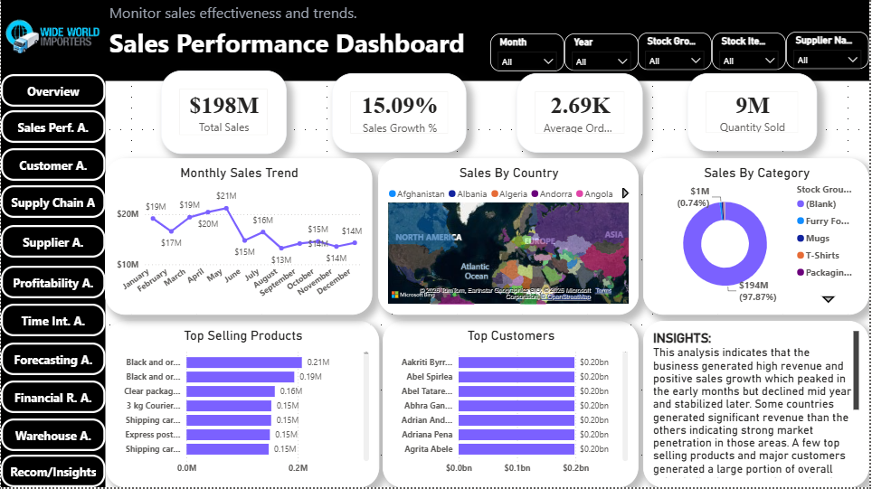

---

### 👥 Customer Analytics
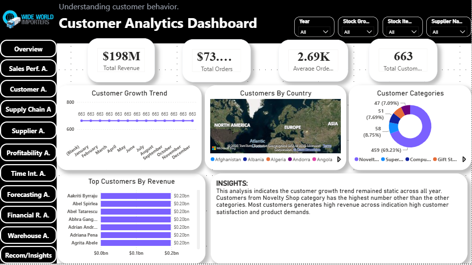

---

### 🚚 Supply Chain & Logistics Analysis
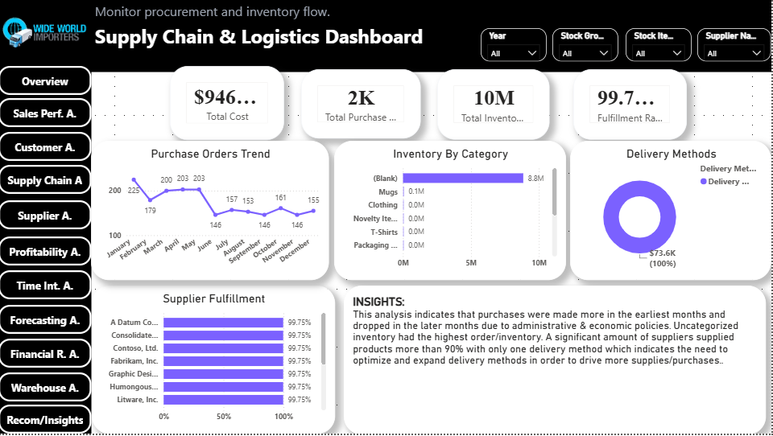

---

### 🧾 Supplier / Vendor Analysis
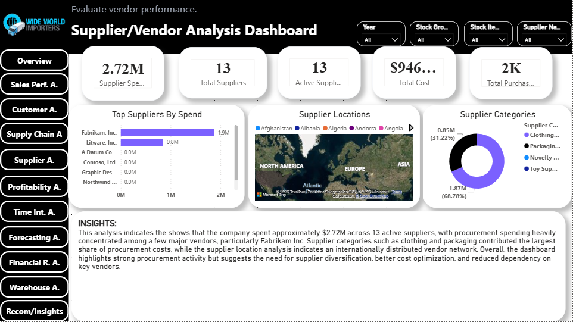

---

### 📉 Profitability Analysis
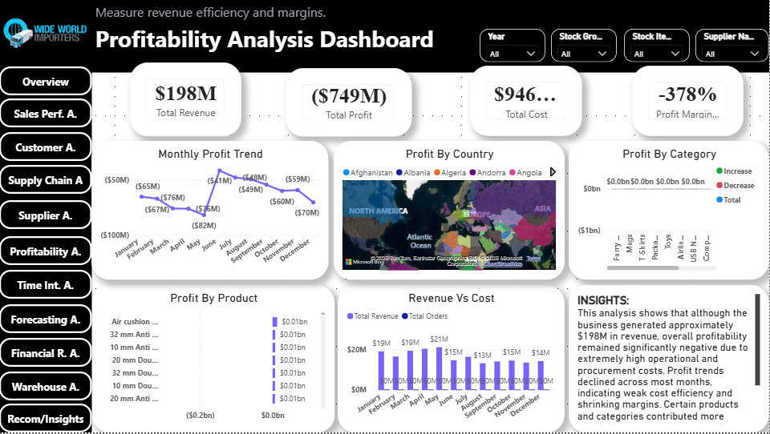

---

### 📅 Time Intelligence Analysis
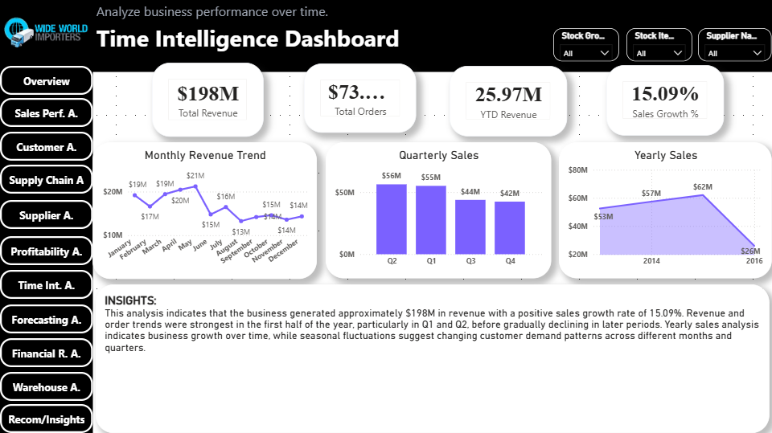

---

### 🔮 Forecasting & Predictive Analysis
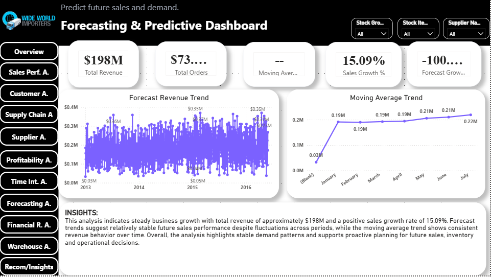

---

### 💳 Financial Reporting Analysis
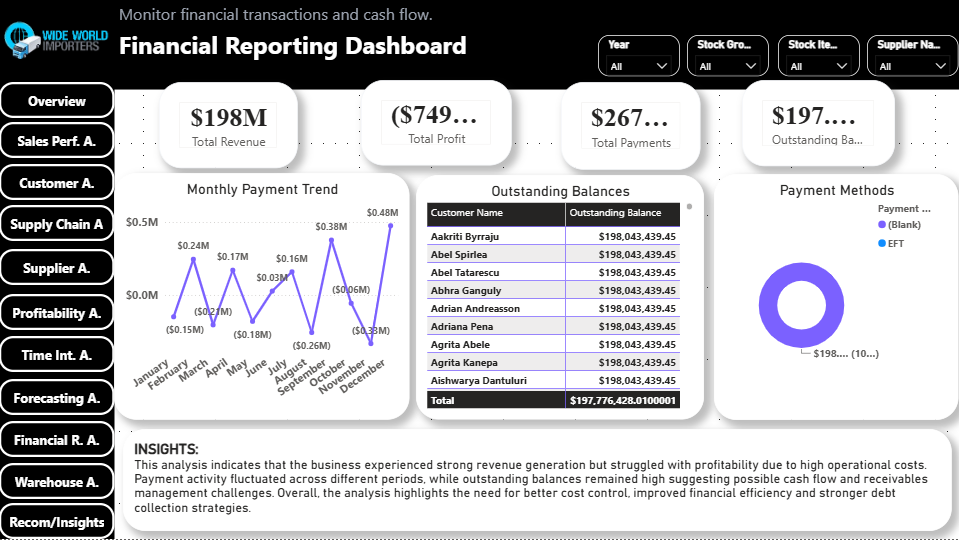

---

### 🏬 Warehouse Analysis
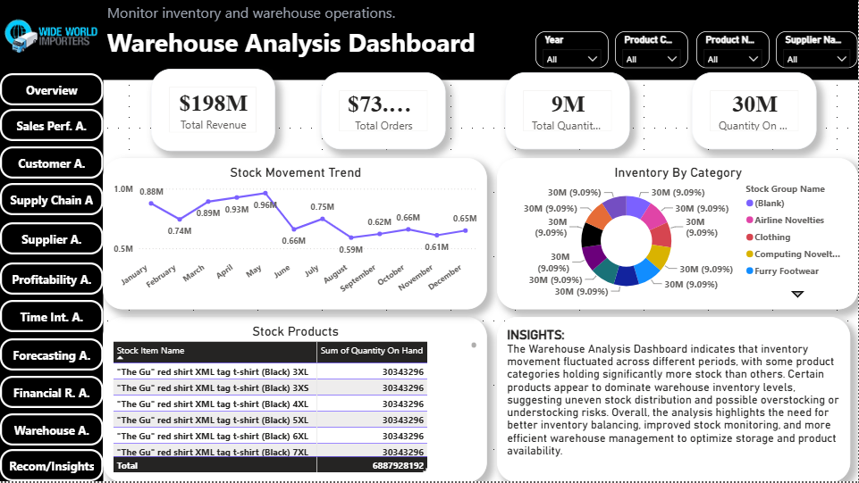

---

### 💡 General Insights & Recommendations
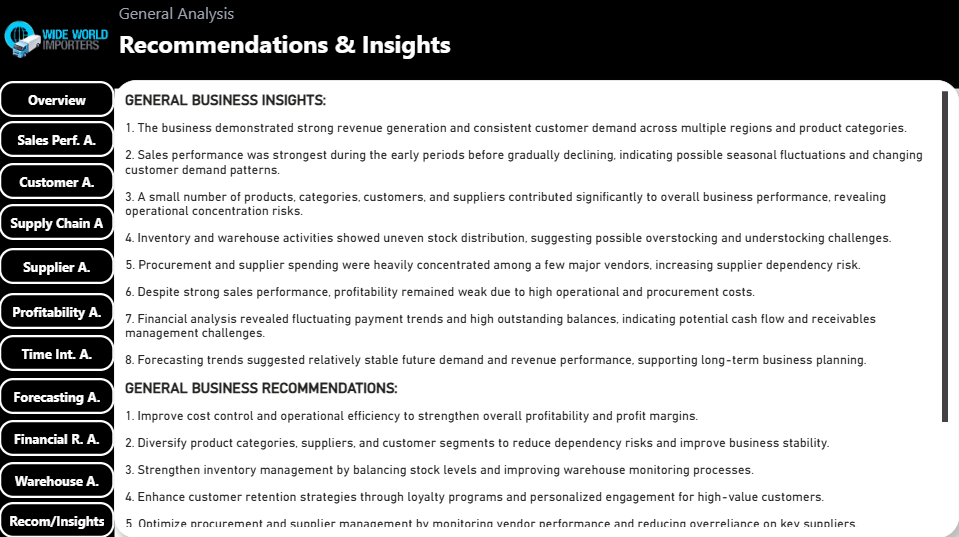

---

## 🔍 Key Business Insights

Some of the major business insights from the analysis include:

- The business generated approximately **$198M in revenue**, but profitability remained significantly negative due to high operational and procurement costs.
- Sales performance was strongest in earlier periods before gradually declining, indicating possible seasonality and changing demand patterns.
- Revenue generation and customer demand were concentrated among a relatively small number of products, customers and categories.
- Procurement activity was heavily concentrated among a few suppliers, creating supplier dependency risk.
- Warehouse and inventory movement showed uneven product distribution, suggesting overstocking and understocking challenges across product categories.
- Financial reporting revealed fluctuating payment activity and high outstanding balances, highlighting cash flow and receivables management concerns.
- Forecasting results suggested relatively stable future demand patterns despite fluctuations across reporting periods.

---

## 🚀 Future Improvements

Future versions of this project may include:

- More advanced demand forecasting models
- Customer segmentation and retention scoring
- Supplier risk scoring models
- Profitability optimization scenarios
- Real-time SQL-to-Power BI reporting pipelines
- Deeper warehouse replenishment analytics

---

## 💼 Skills Demonstrated

This project highlights practical experience across:

- SQL database setup and querying
- Power BI dashboard development
- Power Query data transformation
- Data cleaning and preprocessing
- Data modeling and relationship building
- DAX calculations and KPI development
- Forecasting and trend analysis
- Financial and profitability analysis
- Supply chain and warehouse analytics
- Executive reporting and data storytelling

---

## 📌 Key Takeaways

This project demonstrates my ability to build a complete business intelligence solution from raw database files through to executive dashboards and strategic insights. It reflects hands-on experience in **SQL, Power BI, Power Query, DAX, data modeling, KPI design, dashboard storytelling and business analysis** across sales, finance, supply chain, warehouse and forecasting domains.

---

## 👩🏽‍💻 Author

**Adaku Bridget Nwaolisa**  
Aspiring Data Analyst passionate about transforming data into actionable business insights.
